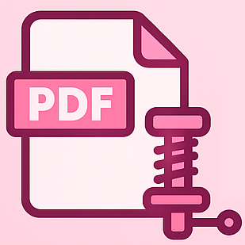

<p align="center">
  
</p>

<h1 align="center">
  
  Compressor PDF Online
</h1>

<p align="center">
  <a href="https://souzadolglas.github.io/compressor_pdf/">🌐 Acessar Aplicação Online</a>
</p>

---

### 📌 Sobre

**Compressor PDF Online** é uma aplicação leve e intuitiva para **reduzir o tamanho de arquivos PDF** diretamente no navegador, sem precisar instalar nada.

Ideal para quem quer otimizar PDFs para envio por e-mail, upload em sistemas ou armazenamento mais eficiente.

---

### 🚀 O que ele faz

- 📄 Comprime arquivos PDF usando dois métodos:
  - **Rebuild com pdf-lib** (vetores preservados)
  - **Conversão para Imagem JPEG** (com personalização de escala e qualidade)
- 🔍 Permite visualizar detalhes das páginas com zoom
- ⚙️ Interface responsiva com animações suaves
- 📦 Tudo rodando 100% no navegador

---

### 💻 Tecnologias usadas

- HTML5 + CSS3 (com Bootstrap 5 e Animate.css)
- JavaScript (puro)
- [pdf-lib](https://pdf-lib.js.org/), [jsPDF](https://github.com/parallax/jsPDF) e [pdf.js
  ](https://mozilla.github.io/pdf.js/)

---

### 📂 Estrutura de diretórios

```bash
compressor-pdf-online/
├── README.md
├── assets/
│   ├── icons/
│   │   ├── isologo.ico
│   │   └── isotipo.ico
│   └── images/
│       ├── isologo.png
│       └── isotipo.png
├── compressor-pdf-online/
│   ├── index.html
│   └── static/
│       ├── css/
│       │   └── style.css
│       ├── icons/
│       │   ├── isologo.ico
│       │   └── isotipo.ico
│       ├── images/
│       │   ├── isologo.png
│       │   └── isotipo.png
│       └── js/
│           └── app.js
```

---

### 📦 Como usar localmente

Se quiser rodar offline:

1. Clone o repositório:
   ```bash
   git clone https://github.com/souzadolglas/compressor_pdf.git
   ```
2. Abra o arquivo:
   ```
   compressor-pdf-online/index.html
   ```

Pronto, tudo funciona direto no navegador.

---

### 👨‍💻 Autor

> AcesCrow – Soluções práticas em Python, Machine Learning, AI, Web e Automação.

---
